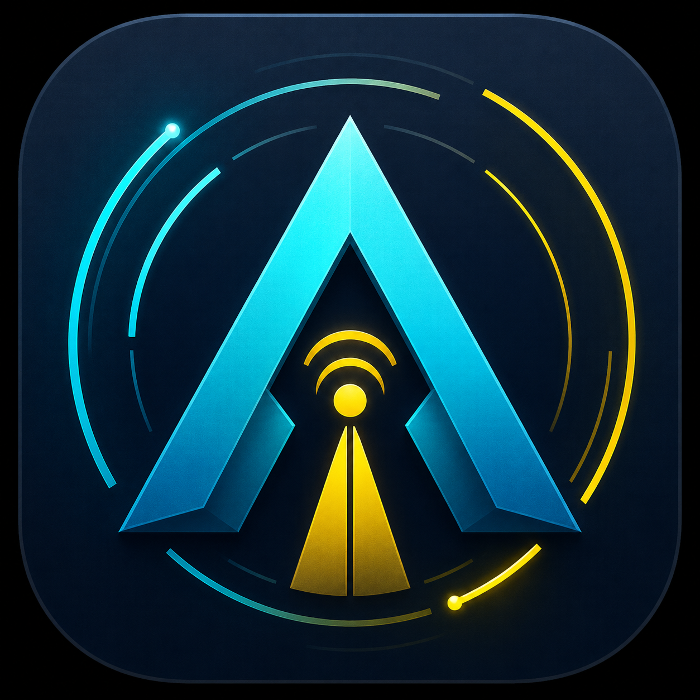
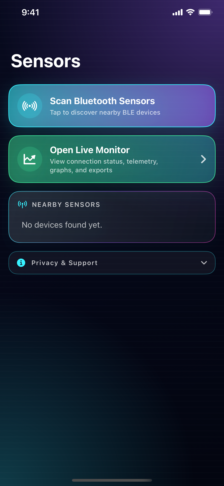

# AIMNet

<p align="center">
  
</p>

AIMNet is an iPhone and iPad app for connecting to compatible AIMNet Bluetooth Low Energy gas sensors and monitoring live methane and H2S telemetry.

The app scans for nearby AIMNet BLE devices, connects to supported sensors, displays live telemetry, records connected sessions, and lets users share session exports as CSV or JSON through the standard iOS share sheet.

## Screenshot

<p align="center">
  
</p>

## Features

- Bluetooth scanning for compatible AIMNet sensors
- Live methane and H2S telemetry display
- H2S estimated PPM display based on field calibration values
- Connection status, detected-device type, and raw payload inspection
- Session recording while connected
- CSV and JSON sharing through AirDrop, Mail, Drive, and other installed apps
- Universal iPhone and iPad support

## Compatible Devices

AIMNet looks for BLE peripherals whose advertised name begins with:

```text
AIMNet
```

The app requires compatible AIMNet methane or H2S sensor hardware for live data.

## App Store Assets

App Store preparation files live in [`app-store/`](app-store/):

- [`aimnet.png`](app-store/aimnet.png): source app icon image
- [`screenshots/iphone-6-5/01-sensors.png`](app-store/screenshots/iphone-6-5/01-sensors.png): 6.5-inch iPhone screenshot
- [`app-store-metadata-draft.md`](app-store/app-store-metadata-draft.md): App Store listing draft
- [`app-privacy-answers-draft.md`](app-store/app-privacy-answers-draft.md): App privacy answer draft
- [`aimnet-privacy-policy.md`](app-store/aimnet-privacy-policy.md): privacy policy draft

## Development

Open the Xcode project:

```sh
open ios/AIMnetMethane/AIMNET/AIMNET.xcodeproj
```

Build from the command line:

```sh
xcodebuild \
  -project ios/AIMnetMethane/AIMNET/AIMNET.xcodeproj \
  -scheme AIMNET \
  -sdk iphonesimulator \
  -destination 'platform=iOS Simulator,name=iPhone 16 Pro,OS=18.5' \
  build
```

## Privacy

Sensor readings stay on device unless the user chooses to share an export. The app does not require login or account creation.

Support URL: [https://nexlusense.com](https://nexlusense.com)  
Privacy Policy URL: [https://nexlusense.com/aimnet-privacy-policy](https://nexlusense.com/aimnet-privacy-policy)
